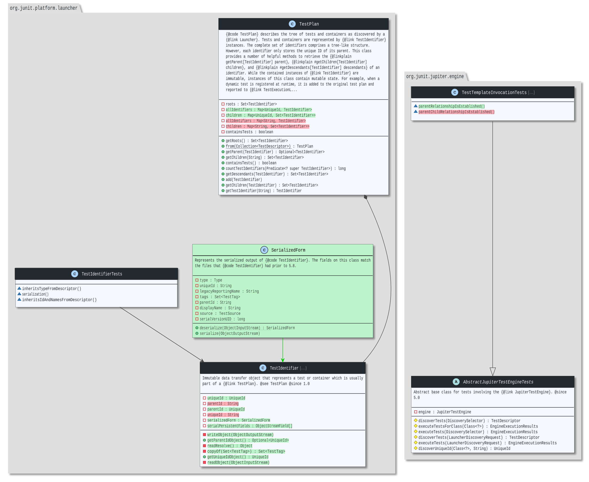

# [striff-lib](https://striff.io)
     

### Architectural Diagrams, Made For Code Reviews.
Striffs leverage the basic premise surrounding the utility of line-wise code diffs at an architectural level, and encourage a more natural understanding of code changes through a "top-down" approach which more closely resembles the lens from which the system was designed and intended to be understood. 

### Getting Started
* Ensure `graphviz` is installed on your system.
* Execute `mvn clean package assembly:single` to  build jar. 
* `StriffAPITest.java` demonstrates how to use this library to generate striff diagrams. 

